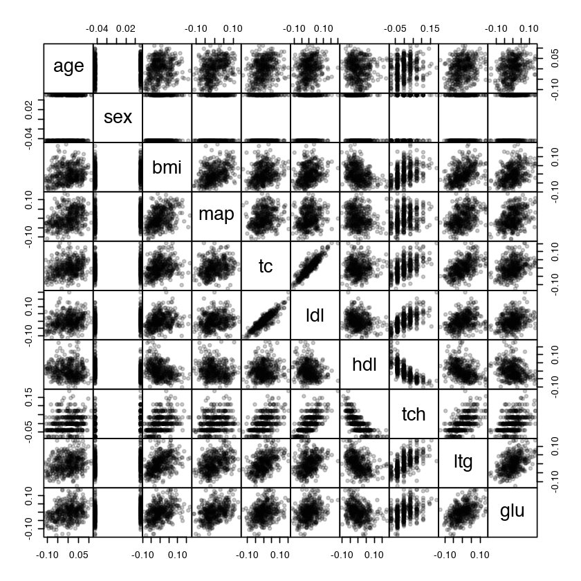
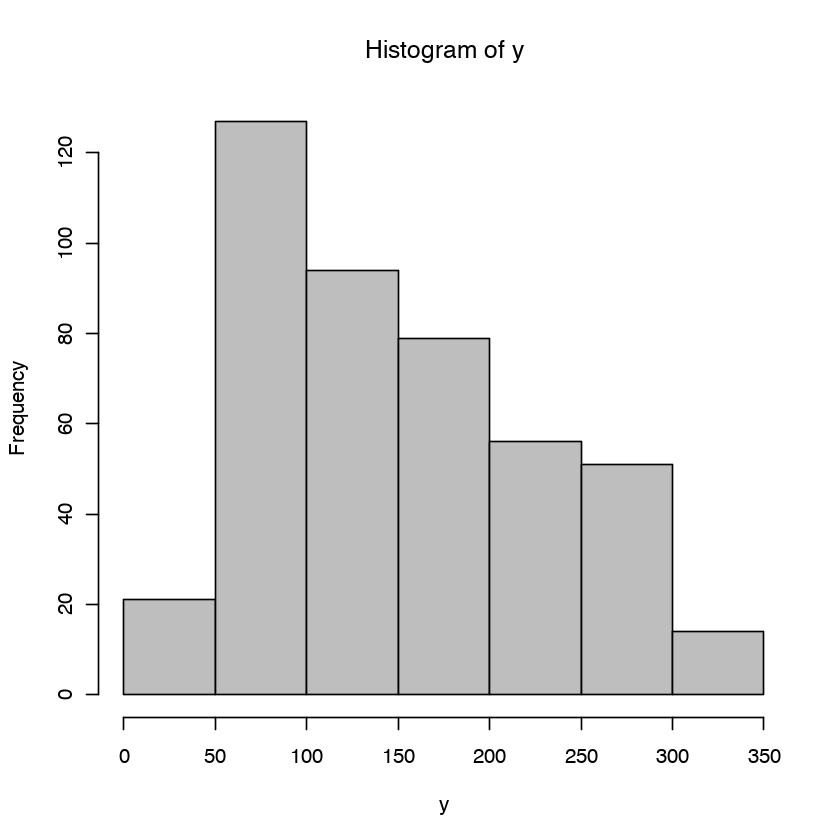
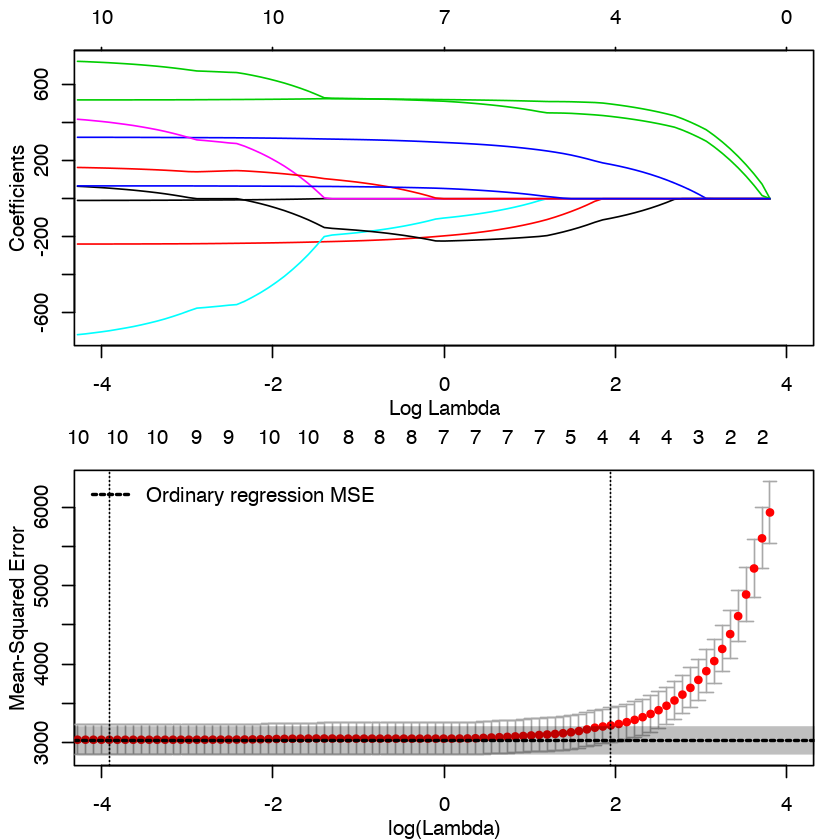
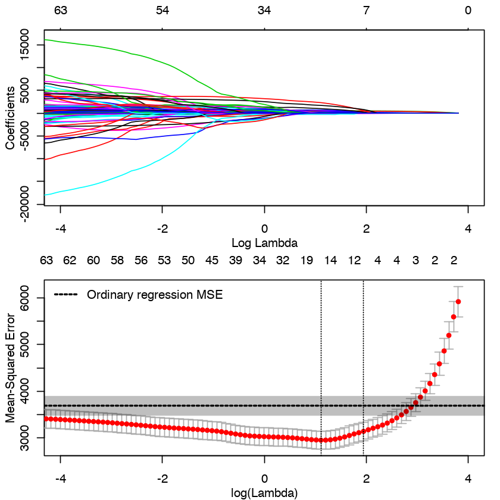

Tutorial on Regularization and Crossvalidation
==============================================

This tutorial is based on https://github.com/tyarkoni/PPS2016

by christian.pfeiffer@uzh.ch

Load and examine data
---------------------

The dataset we’ll use is concerned with predicting the severity of
diabetes. The dataset lives in the ``lars`` package:

.. code:: r

    if(!require("lars")){
      install.packages("lars")
      library("lars")
    }
    data("diabetes")

.. parsed-literal::

    Loading required package: lars
    
    Loaded lars 1.2
    
    

Let’s do a little preliminary examination of the data. There are 442
observations, and we have 10 predictors to use for prediction, which
we’ll store in a matrix called ``X``. They look like this:

.. code:: r

    X <- diabetes$x
    (N <- nrow(X))
    pairs(X, pch=20, gap=0, col=rgb(0,0,0,.2))

.. raw:: html

    442

Our response variable, which we’ll store as a vector ``y``, is some
medical indicator of the severity of diabetes. It’s a continuous
variable and its distribution looks like this:

.. code:: r

    y <- diabetes$y
    hist(y, col="gray")

Fit ordinary multiple regression model
--------------------------------------

To start off, let’s see what it looks like if we just throw these 10
predictors into a multiple regression model predicting ``y``:

.. code:: r

    reg <- lm(y ~ X)
    summary(reg)

.. parsed-literal::

    
    Call:
    lm(formula = y ~ X)
    
    Residuals:
         Min       1Q   Median       3Q      Max 
    -155.829  -38.534   -0.227   37.806  151.355 
    
    Coefficients:
                Estimate Std. Error t value Pr(>|t|)    
    (Intercept)  152.133      2.576  59.061  < 2e-16 ***
    Xage         -10.012     59.749  -0.168 0.867000    
    Xsex        -239.819     61.222  -3.917 0.000104 ***
    Xbmi         519.840     66.534   7.813 4.30e-14 ***
    Xmap         324.390     65.422   4.958 1.02e-06 ***
    Xtc         -792.184    416.684  -1.901 0.057947 .  
    Xldl         476.746    339.035   1.406 0.160389    
    Xhdl         101.045    212.533   0.475 0.634721    
    Xtch         177.064    161.476   1.097 0.273456    
    Xltg         751.279    171.902   4.370 1.56e-05 ***
    Xglu          67.625     65.984   1.025 0.305998    
    ---
    Signif. codes:  0 ‘***’ 0.001 ‘**’ 0.01 ‘*’ 0.05 ‘.’ 0.1 ‘ ’ 1
    
    Residual standard error: 54.15 on 431 degrees of freedom
    Multiple R-squared:  0.5177,	Adjusted R-squared:  0.5066 
    F-statistic: 46.27 on 10 and 431 DF,  p-value: < 2.2e-16

The Root Mean Squared Error (RMSE) – which the ``summary()`` function
calls the “Residual standard error” – is about 54. In other words, the
model’s predicted ``y`` values tended to be within about 54 units of the
actual ``y`` values. Based on the distribution of ``y`` that we saw
above, that seems pretty good!

However, as we just learned in the main text, this is likely an
overestimate of this model’s out-of-sample performance on future
datasets. To get a good estimate of the test/prediction error, we can
use **cross-validation**.

10-fold cross-validation (CV) by hand
-------------------------------------

Let’s estimate the test/prediction error by 10-fold cross-validation,
which we’ll implement by hand first for instructional purposes.

First we shuffle the rows of the dataset, just in case they weren’t put
in the dataset in random order. We’re going to partition the dataset
into “folds” by selecting the first :math:`N/10` rows for Fold #1, the
next :math:`N/10` rows for Fold #2, and so on, so we want to make sure
the folds don’t systematically differ based on their original position
in the dataset.

.. code:: r

    set.seed(12345) # the same combination i have on my luggage!
    new_indices <- sample(nrow(X))
    y <- y[new_indices]
    X <- X[new_indices,]

Now lets take all the indices – that is, the numbers corresponding to
each row of the dataset (1 to 442) – and split them into 10 groups of
roughly equal size.

.. code:: r

    breaks <- round(quantile(seq(N), probs=seq(0, 1, .1)))
    groups <- cut(seq(N), breaks=breaks, include.lowest=TRUE)
    indices <- split(seq(N), groups)
    str(indices)

.. parsed-literal::

    List of 10
     $ [1,45]   : int [1:45] 1 2 3 4 5 6 7 8 9 10 ...
     $ (45,89]  : int [1:44] 46 47 48 49 50 51 52 53 54 55 ...
     $ (89,133] : int [1:44] 90 91 92 93 94 95 96 97 98 99 ...
     $ (133,177]: int [1:44] 134 135 136 137 138 139 140 141 142 143 ...
     $ (177,222]: int [1:45] 178 179 180 181 182 183 184 185 186 187 ...
     $ (222,266]: int [1:44] 223 224 225 226 227 228 229 230 231 232 ...
     $ (266,310]: int [1:44] 267 268 269 270 271 272 273 274 275 276 ...
     $ (310,354]: int [1:44] 311 312 313 314 315 316 317 318 319 320 ...
     $ (354,398]: int [1:44] 355 356 357 358 359 360 361 362 363 364 ...
     $ (398,442]: int [1:44] 399 400 401 402 403 404 405 406 407 408 ...

And we’re ready to cross-validate!

.. code:: r

    # empty vector to hold results
    RMSE <- numeric(10)
    # do this stuff for each fold
    for(i in 1:10){
      # regress y (leaving out ith fold) on X (leaving out ith fold)
      mod <- lm(y[-indices[[i]]] ~ X[-indices[[i]],])
      # compute and save RMSE
      RMSE[i] <- sqrt(mean(mod$residuals^2)) 
    }

And we compute our estimated test or out-of-sample RMSE as the mean of
the RMSEs we got from all 10 folds. We can also look at the standard
deviation of these RMSEs for a sense of the uncertainty in this RMSE
estimate.

.. code:: r

    mean(RMSE)
    sd(RMSE)

.. raw:: html

    53.4053498016839

.. raw:: html

    0.538871554735656

Recall that the in-sample RMSE computed on our full training dataset was
about 54. So in this case, the test/prediction RMSE is hardly higher at
all. This is actually not too surprising, since our ratio of sample size
(442) to number of predictors (10) is quite favorable, and we have a few
predictors with pretty strong associations with ``y``.

10-fold CV the easy way
-----------------------

Of course, in actual practice we usually wouldn’t bother with doing
cross-validation by hand. Instead, we would use one of the many
pre-packaged tools that can do this task quickly and easily for us. One
of these tools is the ``caret`` package.

.. code:: r

    if(!require("caret")){
      install.packages("caret")
      library("caret")
    }

.. parsed-literal::

    Loading required package: caret
    
    Loading required package: lattice
    
    Loading required package: ggplot2
    

To do 10-fold CV using ``caret``, all we need to write is the following:

.. code:: r

    #ctrl <- trainControl(method="cv", number=10)
    ctrl <- trainControl(method="repeatedcv", number=10, repeats=10)
    model <- train(y=y, x=X, trControl=ctrl, method="lm")
    model

.. parsed-literal::

    Linear Regression 
    
    442 samples
      1 predictor
    
    No pre-processing
    Resampling: Cross-Validated (10 fold, repeated 10 times) 
    Summary of sample sizes: 398, 397, 398, 398, 399, 397, ... 
    Resampling results:
    
      RMSE      Rsquared   MAE    
      54.46933  0.5066898  44.2584
    
    Tuning parameter 'intercept' was held constant at a value of TRUE

The test RMSE estimate obtained from ``caret`` agrees well with the test
RMSE estimate that we got from our hand-rolled CV code, which is good –
however, while the estimates are very similar, you’ll notice that
they’re not exactly the same. What gives?

The slight disrepancy is due to random differences in how the dataset is
divided into the 10 independent folds. There are an astronomical number
of unique ways that we could partition 442 observations into 10
roughly-equally sized groups, and each of these partitions would yield a
slightly different CV estimate. To try to reduce the variance associated
with randomly selecting only one of these possible partitions, we could
use what is called *repeated cross-validation*, where basically we just
do K-fold cross-validation multiple times – maybe 10 times, say – using
a different partitioning each time, and then use the average of all 10
of those K-fold CV estimates as our final estimate. We won’t illustrate
that procedure here, but it’s worth pointing out that we could easily
ask ``caret`` to do this for us by simply replacing the line of code
above reading ``ctrl <- trainControl(method="cv", number=10)`` instead
with
``ctrl <- trainControl(method="repeatedcv", number=10, repeats=10)``.

Lasso model
-----------

Now let’s see how well we can do if we apply some regularization to our
regression model using the Lasso. There are several packages in R that
will implement the Lasso, including the ``caret`` package that we’ve
already seen, but perhaps the nicest package is the ``glmnet`` package.

.. code:: r

    if(!require("glmnet")){
      install.packages("glmnet")
      library("glmnet")
    }

.. parsed-literal::

    Loading required package: glmnet
    
    Loading required package: Matrix
    
    Loading required package: foreach
    
    Loaded glmnet 2.0-18
    
    

To train the Lasso model using ``glmnet``, all we need are the following
lines of code:

.. code:: r

    lasso <- glmnet(x=X, y=y)
    CV <- cv.glmnet(x=X, y=y)

We’re going to want to compare Lasso’s estimated test error to the
estimated test error of the unregularized regression model, so to make
sure we’re comparing apples and apples – that is, to make sure we’re
using the exact same method of cross-validation for both models – let’s
also fit an ordinary regression model using ``glmnet``. To do this,
we’ll just run ``glmnet`` with an almost infinitesimally small value for
lamda (the parameter controlling the amount of regularization), so that
it essentially does not regularize at all and just fits a regression
model.

.. code:: r

    reg_CV <- cv.glmnet(x=X, y=y, lambda=exp(-100:-99))

One of the cool things about ``glmnet`` is that it will easily spit out
some really nice plots that let us see the results of applying different
amounts of regularization. Remember, higher values of lambda imply more
regularization, that is, coefficients are pushed more strongly toward 0.

.. code:: r

    # adjust the plot layout to make a two-panel plot
    layout(rbind(1,2))
    par(mar=c(3,3,2,1)+.1)
    
    # coefficient path plot
    plot(lasso, xvar="lambda", xlim=c(-4,4), mgp=2:0)
    
    # CV error plot
    plot(CV, xlim=c(-4,4), mgp=2:0)
    
    # add the baseline performance of the ordinary regression model
    with(reg_CV, polygon(x=c(-10,10,10,-10,-10),
                         y=c(cvup[1],cvup[1],cvlo[1],cvlo[1],cvup[1]),
                         border=NA, col=rgb(0,0,0,.25)))
    abline(h=reg_CV$cvm[1], lty=2, lwd=2)
    legend("topleft", lty=2, lwd=2, legend="Ordinary regression MSE", bty="n")

The top panel shows the *coefficient paths*, that is, it shows the
values of all the estimated regression coefficients (slopes) as a
function of lambda. You can see that the more regularization is applied,
the more the coefficients are pushed toward 0. The numbers along the top
of both panels give the number of predictors that still have non-zero
regression coefficients for that level of lambda. At the far right side
of the plot, the regularization is so strong that all of the
coefficients have been pushed down to 0.

The bottom panel shows the estimated test error (estimated via repeated
10-fold cross-validation) as a function of lambda. Note that the y-axis
is in units of mean squared error, rather than root mean squared error
(RMSE) as we were been using above, but we can simply take the square
root of these values to turn them back into RMSEs if we want to. By
default the plot includes two vertical dotted lines. The line on the
left gives the optimal value of lambda, that is, the value of lambda
that led to the lowest estimated test error. The line on the right gives
the value of lambda that satisfies the “one standard error rule”, which
says to pick the simplest model whose estimated test error is still
within one standard error of the optimal model. For reference, the gray
band and thick, dashed line represent the baseline performance of the
ordinary regression model that uses no regularization.

The basic lesson from these plots is that in this case, with these
predictors, the Lasso does not offer any real advantage over the
ordinary regression model. The optimal value of lambda is technically
one in which some regularization is applied and 3 of the predictors are
dropped from the model, but the CV error of this model is essentially
the same as in the ordinary regression model. In fact, all values of
lambda below about log(lambda)=1 or so lead to the same performance as
in the regression model, and above that the test error suffers. However,
we can also see that if we apply the one standard error rule, we could
drop half of the predictors from the model entirely, and the estimated
test error for this simpler model would not be appreciably higher than
in the optimal (regression) model.

Adding nonlinear predictors
---------------------------

Now let’s make things a little more interesting. Geometrically speaking,
so far we have only attempted to fit a hyperplane to the data. But it’s
possible that we could do better using a more complicated model that
fits a curved, nonlinear surface to the data. One easy way to achieve
this is by adding in a bunch of predictors corresponding to all possible
products of the original 10 predictors – essentially, we add the two-way
interactions between all the predictors as well as the squared terms for
each predictor.

.. code:: r

    pairs <- t(combn(ncol(X), 2))
    interactions <- sapply(seq(choose(ncol(X), 2)), function(i){
      X[,pairs[i,1]]*X[,pairs[i,2]]
    })
    X2 <- cbind(X, X^2, interactions)

This augmented dataset, ``X2``, has 65 predictors instead of just 10:

.. code:: r

    ncol(X2)

.. raw:: html

    65

Now let’s see how the Lasso and regression models do using this larger,
more flexible set of predictors.

.. code:: r

    # fit the models
    lasso2 <- glmnet(x=X2, y=y)
    CV2 <- cv.glmnet(x=X2, y=y)
    reg_CV2 <- cv.glmnet(x=X2, y=y, lambda=exp(c(-10,-9)))
    
    # adjust the plot layout to make a two-panel plot
    layout(rbind(1,2))
    par(mar=c(3,3,2,1)+.1)
    
    # coefficient path plot
    plot(lasso2, xvar="lambda", xlim=c(-4,4), mgp=2:0)
    
    # CV error plot
    plot(CV2, xlim=c(-4,4), mgp=2:0)
    
    # add the baseline performance of the ordinary regression model
    with(reg_CV2, polygon(x=c(-10,10,10,-10,-10),
                          y=c(cvup[1],cvup[1],cvlo[1],cvlo[1],cvup[1]),
                         border=NA, col=rgb(0,0,0,.25)))
    abline(h=reg_CV2$cvm[1], lty=2, lwd=2)
    legend("topleft", lty=2, lwd=2, legend="Ordinary regression MSE", bty="n")

There are a couple interesting things to notice here.

First, we can see that the Lasso now outperforms the regression model –
that is, there are values of lambda under which the Lasso’s CV error is
notably better than regression’s CV error. Interestingly, the optimal
value of lambda implies dropping about three-quarters of the predictors
from the model entirely, although we still end up retaining more (about
15) than we had with the previous set of simpler predictors.

The second thing is to notice how the Lasso and regression model respond
to the increased flexibility that we gave to them. For the regression
model, when we allowed it to use all those nonlinear predictors, it
happily did so, and it found a solution that seemed to be even better
than with the simple predictors – recall that the in-sample RMSE of the
regression model was about 54 before, but now it’s about 53 using the
more complex predictor set:

.. code:: r

    summary(lm(y ~ X2))$sigma

.. raw:: html

    53.2303931365132

But when we look at the CV error of the regression model, we can see
that this increase in accuracy is in fact an illusion, a result of
nothing but increased overfitting. When using the augmented predictor
set, the regression’s CV error actually *increased* from about RMSE=54
to about RMSE=59:

.. code:: r

    sqrt(reg_CV2$cvm[1])

.. raw:: html

    60.7396731155804

In other words, the regression model appears naively to have done better
using the increased flexibility, but it actually did worse.

The Lasso, on the other hand, was not fazed by the increased
flexibility. The Lasso’s CV error, recall, was about RMSE=54 using the
simple predictor set, and it remains at about RMSE=54 using the
augmented predictor set:

.. code:: r

    with(CV2, sqrt(cvm[lambda == lambda.min]))

.. raw:: html

    54.3447511201954

So, while the Lasso was not able to take advantage of the increased
flexibility to actually make better predictions, it did at least avoid
using this flexibility to overfit the data, unlike the regression model.

Bonus material: Nested cross-validation
---------------------------------------

So far, our strategy has been to select the model (i.e., the value of
lambda) that leads to the best CV error, and then to use that CV error
as our estimate of the test error. But if we’re simply selecting the
value of lambda that minimizes the CV error computed using all the data
at hand, then doesn’t this open the door to overfitting the data with
respect to our selection of lambda? The method of CV we’ve been using
takes into account the fact that the regression coefficients are
selected so as to minimize error in the training data, but it ignores
the possibility that we may also be selecting *lambda* so as to minimize
error in the training data. Because of this, if we do use CV error to
select a value of lambda – rather than just using the CV error to tell
us about the test error, without using that CV error to make any model
selection decisions – then this does render the simple CV error an
overly optimistic estimate of the true test error we would experience in
future data.

It is possible to correct for this optimistic bias using *nested
cross-validation*. The basic idea is that we extend the simple CV
procedure so that the selection of lambda takes place within each loop
or fold of the CV, rather than only taking place after the fact. In
simple CV, the same fixed value of lambda is used for each fold. In
nested CV, different folds can use different values of lambda.

Concretely, here is what it looks like:

.. code:: r

    # empty vector to hold results
    RMSE <- numeric(10)
    # do this stuff for each fold
    for(i in 1:10){
      # fit LASSO to the 9 training folds
      mod <- cv.glmnet(x=X2[-indices[[i]],], y=y[-indices[[i]]])
      # get predicted values for test fold using "optimal" lambda from training
      predictions <- mean(y[indices[[i]]]) + X2[indices[[i]],] %*%
        mod$glmnet.fit$beta[,which.min(mod$cvm)]
      # compute and save RMSE
      errors <- y[indices[[i]]] - predictions
      RMSE[i] <- sqrt(mean(errors^2))
    }
    mean(RMSE)

.. raw:: html

    54.8275051323134

Note that in this case, the nested CV error is pretty much the same as
the simple CV error, which we estimated earlier to be about 54.
Basically, if we are only fiddling with a single tuning parameter
(lambda) and the sample size is not too small, then the optimistic bias
of simple CV tends to be negligible. The cases where nested CV tends to
make a big difference are when we are using the CV error to select among
many models, each possessing multiple tuning parameters, and the size of
the training set is relatively small so that performance can vary
drastically from fold to fold. In such cases, the simple CV error can be
a badly over-optimistic estimate of the true test error, because it
ignores the fact that we searched through many, many possible models
before finding the one that minimized the CV error in the training set.
